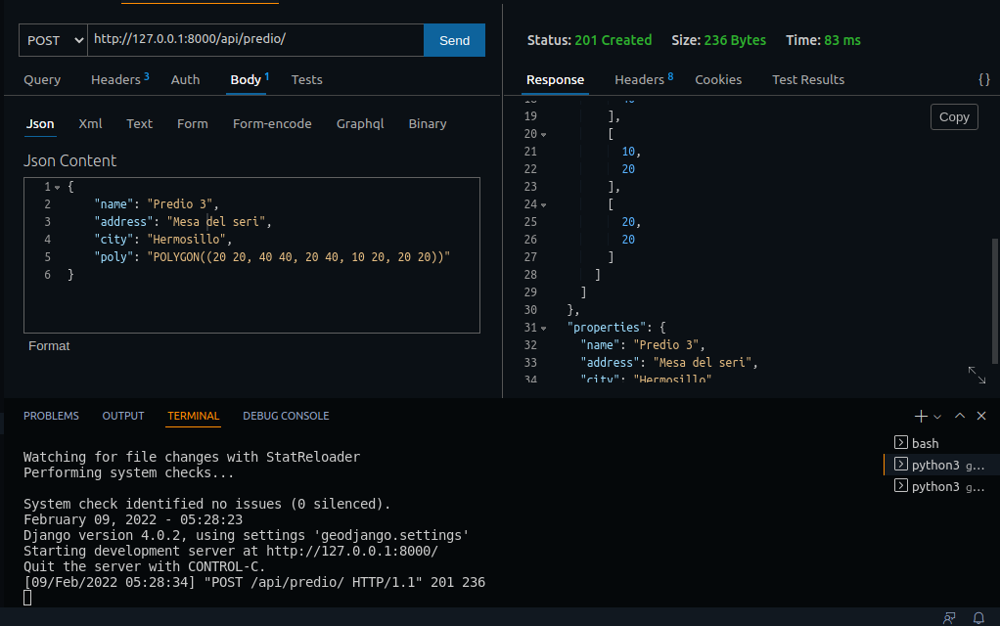
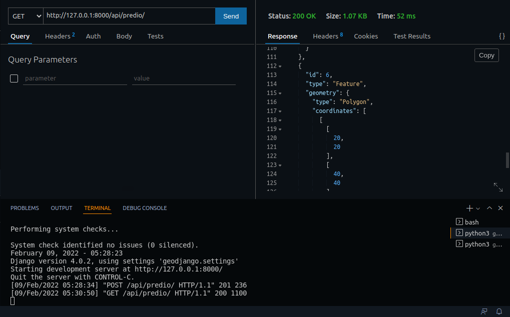

# Projecto de ejercicio para Sinecta

Elaboracion de un GeoAPI 

Sintaxis: 
El ejercicio consiste en crear una API Rest que se comunique con la interfaz de la imagen y que le permita al usuario crear polígonos en una base de datos geoespacial montada en PostGIS a partir de un string WKT como input del usuario. 

La única tecnología obligatoria es Postgres y PostGIS para el manejo de los datos, fuera de ahí siéntete libre de utilizar lo que te haga sentir más cómodo. No es necesario montarlo en línea, con compartir el proyecto en GitHub es suficiente.

